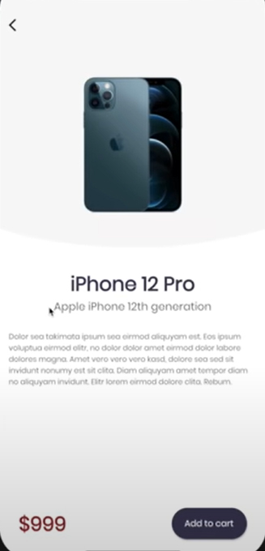

# Trending Cart

This is an e-commerce app where you can buy latest electronic gadgets which are in trend.

<h1 align="center">

</h1>

## Features
- Users will be able to use the app in both light as well as dark mode.
- Only authenticated users will be able to use the app.
- All latest electronic gadgets which are present in the market will be displayed on this app.
- Users of this app will not feel any need to search for trending products on Google. It will save their time.

## Tech-Stack

## How to use?
- Just install the app on the device.
- Now create the account, if you are using it for first time.
- Now, the list of latest available products will be fetched and users will be able to add products to their cart.
- The number of added products will be displayed on the cart floating action button and also on the Cart page.
- Finally, users will see the total amount to be paid and they can proceed further. 

## Technical Details
- Built in Flutter 2.13.0.
- Uses Firebase to authenticate the users.
- Vx library is used to design the whole UI, which makes the work very much easy.
- Various newly added widgets in Flutter 2.13.0 are also used.

## Some screenshots

|                                      |                                      |
| ------------------------------------ | ------------------------------------ |
|  |  |
|   |   |
